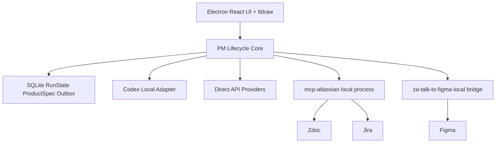

# PM Lifecycle Agent — Product & Technical Specification

> **Purpose of this document**  
> Đây là tài liệu nguồn để một coding agent hiểu sản phẩm, thiết kế kiến trúc và bắt đầu triển khai. Khi có xung đột giữa prompt ngắn hạn và tài liệu này, coding agent phải hỏi lại trước khi thay đổi các quyết định nền tảng.

---

## 1. Executive summary

**PM Lifecycle Agent** là một ứng dụng desktop local-first dành cho PM/Product Team, giúp chuyển một ý tưởng sản phẩm thô thành một bộ tài liệu kickoff nhất quán:

- ProductSpec chuẩn hóa.
- PRD trên Zdoc.
- User flow hoặc low-fidelity screens trên Figma.
- Jira Epic, Stories và Acceptance Criteria.
- Traceability giữa Requirement → Screen → Story → Dependency.
- Impact analysis khi scope thay đổi.

Ứng dụng sử dụng:

- **Codex** hoặc model API khác làm reasoning brain.
- **MCP** làm lớp công cụ để đọc/ghi Zdoc, Jira và Figma.
- **tldraw** làm workspace trực quan cho discovery, decision, delivery mapping và change impact.
- **ProductSpec** làm source of truth nghiệp vụ.
- **SQLite** làm bộ nhớ chạy local, checkpoint, audit và outbox.
- **Người dùng** là authority cuối cùng cho quyết định và mọi write action quan trọng.

Thông điệp cốt lõi:

> Codex giúp hệ thống suy nghĩ; PM Lifecycle Agent sở hữu toàn bộ công việc, trạng thái, quyền phê duyệt và kết quả.

---

## 2. Problem statement

Khi một PM có ý tưởng mới, quy trình hiện tại thường bị phân mảnh:

1. Tìm tài liệu cũ trên Zdoc.
2. Tìm Jira ticket, API hoặc capability có thể tái sử dụng.
3. Hỏi nhiều bên để làm rõ requirement.
4. So sánh các phương án theo value, effort và risk.
5. Viết PRD.
6. Tạo user flow/wireframe.
7. Tạo Jira Epic, Stories, Acceptance Criteria.
8. Cập nhật đồng bộ khi scope đổi.

Các vấn đề thường gặp:

- Ý tưởng được triển khai khi chưa đủ context.
- Các assumption không được ghi nhận.
- PRD, Figma và Jira mô tả các scope khác nhau.
- Requirement không trace được đến design hoặc delivery task.
- Scope đổi nhưng artifact cũ không được cập nhật.
- PM tốn nhiều thời gian cho công việc tổng hợp và đồng bộ thủ công.

PM Lifecycle Agent giải quyết bài toán này bằng một agentic workflow có kiểm soát.

---

## 3. Product vision

### 3.1. Vision statement

> Biến một ý tưởng sản phẩm thô thành một kickoff package có thể review, có evidence, có traceability và có thể cập nhật đồng bộ khi quyết định thay đổi.

### 3.2. Giá trị chính

1. **Faster discovery**  
   Tìm capability, tài liệu và dự án liên quan trước khi đề xuất xây mới.

2. **Better decisions**  
   Sinh nhiều phương án, chỉ ra trade-off và lưu decision rationale.

3. **Consistent artifacts**  
   PRD, Figma và Jira được tạo từ cùng một ProductSpec.

4. **Controlled change**  
   Mọi scope change đều đi qua impact analysis, preview, approval và verification.

5. **Local-first integration**  
   MCP và credential nội bộ có thể chạy trên máy người dùng; không cần backend trung tâm cho MVP.

---

## 4. Target users

### Primary users

- Product Manager.
- Product Owner.
- Business Analyst.
- Technical Product Manager.

### Secondary users

- Designer.
- Tech Lead.
- QA/QC.
- Project Manager.

### Usage context

- Tạo feature/project mới.
- Chuẩn bị kickoff.
- Tái cấu trúc scope MVP.
- Đồng bộ artifact trước khi development bắt đầu.
- Review change request giữa vòng đời dự án.

---

## 5. Scope

### 5.1. MVP scope

MVP tập trung vào vòng đời:

```text
Idea
→ Discovery
→ Clarification
→ Solution Options
→ Human Decision
→ ProductSpec
→ Artifact Preview
→ Zdoc / Jira / Figma Generation
→ Verification
→ Change Impact
```

### 5.2. MVP input

- Một mô tả ý tưởng thô.
- Target user hoặc target business nếu có.
- Deadline hoặc constraint nếu có.
- Zdoc page/space tham chiếu.
- Jira project/epic tham chiếu.
- Figma file/page tham chiếu nếu có.

### 5.3. MVP output

- Discovery findings có source.
- Tối đa ba câu hỏi clarification quan trọng.
- Ba solution options: Minimal, Balanced, Ambitious.
- Decision record.
- ProductSpec.
- PRD preview và Zdoc page.
- Jira Epic + 4–8 Stories + Acceptance Criteria.
- Figma user flow hoặc 3–5 low-fidelity screens.
- Requirement traceability map.
- Change impact preview.
- Execution receipts và verification report.

### 5.4. Non-goals của MVP

Không triển khai:

- Full high-fidelity Figma design.
- Pixel-perfect UI generation.
- Code generation cho production feature.
- Real-time collaboration.
- Multi-user editing.
- Central orchestration backend.
- Autonomous write không có approval.
- Quét toàn bộ organization.
- Generic whiteboard thay thế tldraw/Figma.
- Generic project management platform.
- Full lifecycle đến release monitoring.

---

## 6. Core product flow

### 6.1. Stage 1 — Idea intake

Người dùng nhập ý tưởng, ví dụ:

> Xây Mini App đặt suất ăn trước cho nhân viên, nhận tại pantry và thanh toán bằng ví nội bộ.

Hệ thống tạo `IdeaCard` và phân tích ban đầu:

- Problem.
- Target user.
- Goal.
- Constraint.
- Assumption.
- Open question.

### 6.2. Stage 2 — Internal discovery

Agent tự chọn read tools phù hợp để tìm:

- Existing product capability.
- Existing API/SDK.
- Similar feature/project.
- Past decision.
- Design guideline.
- Known limitation.
- Owner/dependency.

Mỗi finding phải có:

- Source system.
- Source URL hoặc external ID.
- Evidence excerpt/summary.
- Confidence.
- Relevance reason.

### 6.3. Stage 3 — Clarification

Agent hỏi tối đa ba câu có impact cao nhất.

Nguyên tắc:

- Không hỏi lại dữ liệu đã tìm được từ source.
- Ưu tiên câu hỏi ảnh hưởng scope, business rule, dependency hoặc feasibility.
- Mỗi câu phải giải thích vì sao cần trả lời.

### 6.4. Stage 4 — Solution options

Agent sinh ba phương án:

- **Minimal:** time-to-market thấp, dependency ít.
- **Balanced:** cân bằng value, effort, risk.
- **Ambitious:** value lớn hơn nhưng dependency/risk cao hơn.

Mỗi option gồm:

- Included features.
- Excluded features.
- Expected value.
- Estimated effort bucket.
- Key risks.
- Dependencies.
- Reusable capabilities.
- Open assumptions.

### 6.5. Stage 5 — Structured review

Sinh review có cấu trúc từ các góc nhìn:

- Product.
- Technical.
- UX.
- Risk/Operation.

LLM chỉ trả review object. Điểm tổng hợp do code tính theo rule/config.

### 6.6. Stage 6 — Human decision

Người dùng chọn một option hoặc chỉnh option trước khi chọn.

Hệ thống tạo `DecisionRecord`:

- Decision ID.
- Selected option.
- Reason.
- Rejected alternatives.
- Trade-offs.
- Critical assumptions.
- Decision timestamp.

### 6.7. Stage 7 — ProductSpec generation

Từ decision, hệ thống tạo `ProductSpec v1`.

ProductSpec là source of truth để tạo mọi artifact.

### 6.8. Stage 8 — Delivery mapping

Hệ thống map:

```text
Requirement
├── Screen
├── Jira Story
├── Acceptance Criteria
├── Dependency
└── Risk/Test suggestion
```

### 6.9. Stage 9 — Artifact preview and approval

Trước khi ghi ra hệ thống thật, hiển thị:

- Artifact nào sẽ được tạo.
- Nội dung chính.
- Mapping về requirement.
- Side effects.
- Target system.

Người dùng có thể approve theo từng artifact hoặc từng action.

### 6.10. Stage 10 — Execution and verification

Sau approval:

1. Ghi action vào outbox.
2. Gọi MCP hoặc connector.
3. Lưu external ID.
4. Đọc lại artifact.
5. Verify mapping và nội dung quan trọng.
6. Cập nhật trạng thái `verified` hoặc `needs_attention`.

### 6.11. Stage 11 — Change impact

Ví dụ user yêu cầu:

> Bỏ payment khỏi MVP.

Hệ thống phải:

1. Parse change request.
2. Xác định entity bị thay đổi.
3. Traverse traceability graph.
4. Tạo impact set.
5. Hiển thị before/after.
6. Tạo ChangePlan.
7. Chờ approval.
8. Cập nhật ProductSpec.
9. Đồng bộ Zdoc/Jira/Figma.
10. Verify lại.

---

## 7. Vai trò của tldraw

### 7.1. Tldraw không phải source of truth

Tldraw là projection và interaction layer của ProductSpec.

```text
                  ProductSpec
                source of truth
                       │
          ┌────────────┼────────────┐
          ▼            ▼            ▼
       tldraw         Zdoc       Jira/Figma
      projection    projection    projection
```

### 7.2. Canvas views

#### Discover View

```text
Idea
→ Problem
→ Evidence
→ Existing capability
→ Assumption
→ Open question
```

#### Decide View

```text
Minimal | Balanced | Ambitious
→ Reviews
→ Trade-offs
→ Decision
```

#### Deliver View

```text
Requirement
→ Screen
→ Story
→ Dependency
```

#### Change View

```text
Selected entity
→ Impacted entities
→ Before/after diff
→ Proposed actions
```

### 7.3. Custom shapes cho MVP

1. `IdeaCard`
2. `EvidenceCard`
3. `AssumptionCard`
4. `QuestionCard`
5. `SolutionCard`
6. `DecisionCard`
7. `RequirementCard`
8. `ArtifactCard`
9. `RiskDependencyCard`

### 7.4. Canvas relationship types

- `SUPPORTS`
- `CONTRADICTS`
- `DERIVED_FROM`
- `DEPENDS_ON`
- `IMPLEMENTS`
- `DESIGNED_BY`
- `BLOCKS`
- `SELECTED_BY`
- `AFFECTS`

### 7.5. Domain commands

Canvas edit không được ghi thẳng ra Jira/Zdoc/Figma.

Ví dụ:

```json
{
  "type": "MOVE_REQUIREMENT_SCOPE",
  "requirementId": "REQ-004",
  "from": "mvp",
  "to": "phase_2"
}
```

Flow bắt buộc:

```text
Canvas event
→ Domain command
→ Core validation
→ ProductSpec update
→ Impact analysis
→ Canvas rerender
→ Artifact change preview
```

### 7.6. Codex không thao tác pixel-level

Không expose các tool như:

```text
createRectangle(x, y)
moveShape(id, x, y)
drawArrow(...)
```

Chỉ expose domain-level commands:

```text
canvas.render_discovery_map
canvas.render_solution_options
canvas.upsert_requirement
canvas.link_entities
canvas.render_delivery_map
canvas.highlight_impact
canvas.render_change_diff
```

Layout, tọa độ, kích thước, lane và arrow routing do code deterministic xử lý.

---

## 8. Agent architecture

### 8.1. Responsibility model

```text
PM Lifecycle Agent Core = Agent owner
Codex / API model       = Reasoning provider
MCP                     = Tool layer
ProductSpec             = Domain memory
SQLite                  = Execution memory
User                    = Decision & approval authority
```

### 8.2. Core-owned agent loop

```text
Observe current RunState
→ Build ReasoningRequest
→ Ask reasoning provider
→ Validate proposed actions
→ Execute approved read tools
→ Store observations
→ Repeat
→ Produce plan
→ Request approval for writes
→ Execute
→ Verify
```

Core, không phải Codex, chịu trách nhiệm:

- Workflow state.
- ProductSpec.
- Permission.
- Tool allowlist.
- Approval.
- Idempotency.
- Retry.
- Audit.
- Verification.
- Completion condition.

### 8.3. Codex làm reasoning brain

Codex phụ trách:

- Hiểu idea thô.
- Phân tích gap.
- Chọn context cần đọc thêm.
- Semantic search query planning.
- Tổng hợp discovery findings.
- Sinh clarification questions.
- Sinh solution options.
- Review trade-off.
- Semantic matching.
- Sinh ArtifactPlan/ChangePlan dạng cấu trúc.
- Giải thích đề xuất.

Codex không được:

- Sở hữu source of truth.
- Tự sửa SQLite.
- Tự gọi write action ngoài approval flow.
- Tự quyết định một tool result đã verified.
- Tạo tọa độ canvas thủ công.

---

## 9. Reasoning provider abstraction

### 9.1. Mục tiêu

Support nhiều mode:

- Codex dùng local authenticated subscription/session.
- Codex dùng API key.
- Gemini API.
- OpenAI API trực tiếp.
- Anthropic API.
- Company LLM gateway trong tương lai.

### 9.2. Interface đề xuất

```ts
export interface ReasoningProvider {
  readonly id: string

  checkAvailability(): Promise<ProviderStatus>

  reason(request: ReasoningRequest): Promise<ReasoningResult>

  stream?(request: ReasoningRequest): AsyncIterable<ReasoningEvent>

  cancel(runId: string): Promise<void>
}
```

### 9.3. Provider implementations

```text
CodexReasoningProvider
GeminiReasoningProvider
OpenAIReasoningProvider
AnthropicReasoningProvider
CompanyGatewayReasoningProvider
```

### 9.4. Codex integration rule

Codex được gọi qua một local adapter độc lập. Adapter có thể dùng một local protocol/CLI/app server được Codex hỗ trợ tại thời điểm triển khai.

Không cho domain core phụ thuộc trực tiếp vào:

- Codex thread format.
- Codex hidden context.
- Codex-specific event type.
- Đường dẫn credential nội bộ của Codex.

Phải có `CodexEventMapper` và `CodexRequestMapper`.

### 9.5. Reasoning request

```ts
export interface ReasoningRequest {
  runId: string
  goal: string
  phase: WorkflowPhase
  checkpointSummary: string
  productSpecSnapshot: ProductSpec
  observations: Observation[]
  unresolvedQuestions: OpenQuestion[]
  availableActions: AvailableAction[]
  constraints: ReasoningConstraint[]
}
```

### 9.6. Reasoning result

```ts
export interface ReasoningResult {
  summary: string
  proposedActions: ProposedAction[]
  questions?: ClarificationQuestion[]
  findings?: Finding[]
  confidence: number
  stopReason?: "goal_reached" | "insufficient_evidence" | "needs_user_input"
}
```

Mọi output phải được schema-validated trước khi core sử dụng.

---

## 10. Switching provider giữa chừng

### 10.1. Nguyên tắc

Provider switching là **handoff**, không phải chuyển nguyên conversation/session.

Không chuyển được:

- Hidden reasoning.
- Internal plan.
- Context compaction riêng.
- Tool call đang chạy dở.

Chuyển được:

- Goal.
- ProductSpec.
- Discovery findings.
- Evidence.
- Assumptions.
- Decisions.
- Artifact mappings.
- Action receipts.
- Approvals.
- Pending work.
- Checkpoint summary.

### 10.2. Safe checkpoints

Chỉ switch tại ranh giới stage:

```text
IDEA_INTAKE
DISCOVERY
CLARIFICATION
OPTIONS_GENERATION
OPTIONS_REVIEW
WAITING_FOR_DECISION
PRODUCT_SPEC_READY
ARTIFACT_PREVIEW
WAITING_FOR_APPROVAL
VERIFYING
COMPLETED
```

Không switch khi:

- MCP write đang chạy.
- Action đã approve nhưng chưa ghi vào outbox.
- Figma plugin đang mutate document.
- Jira/Zdoc request chưa có receipt.

### 10.3. Handoff sequence

```text
Pause run
→ Wait current tool call
→ Persist checkpoint
→ Close current runtime segment
→ Start new provider segment
→ Send canonical state
→ Re-plan pending work
→ Continue
```

### 10.4. Không auto-fallback gây phí

Nếu subscription hết quota, app phải hỏi người dùng trước khi chuyển sang API key hoặc provider tính phí khác.

---

## 11. Workflow state machine

```text
IDEA_INTAKE
→ DISCOVERY
→ CLARIFICATION
→ OPTIONS_GENERATION
→ OPTIONS_REVIEW
→ WAITING_FOR_DECISION
→ PRODUCT_SPEC_READY
→ ARTIFACT_PREVIEW
→ WAITING_FOR_APPROVAL
→ EXECUTING
→ VERIFYING
→ COMPLETED
```

Change workflow:

```text
CHANGE_REQUESTED
→ IMPACT_ANALYSIS
→ CHANGE_PREVIEW
→ WAITING_FOR_APPROVAL
→ APPLYING_CHANGE
→ VERIFYING
→ COMPLETED
```

Error states:

```text
NEEDS_USER_INPUT
TOOL_UNAVAILABLE
PARTIAL_FAILURE
CANCELLED
FAILED
```

---

## 12. Canonical RunState

```ts
export interface RunState {
  runId: string
  goal: string
  phase: WorkflowPhase
  status: RunStatus

  activeProvider: ProviderRef
  runtimeSegments: RuntimeSegment[]

  idea: ProductIdea
  findings: DiscoveryFinding[]
  assumptions: Assumption[]
  openQuestions: OpenQuestion[]
  decisions: DecisionRecord[]

  productSpec: ProductSpec
  productSpecVersion: number

  artifactMappings: ArtifactMapping[]
  plannedActions: PlannedAction[]
  actionReceipts: ActionReceipt[]
  approvals: ApprovalRecord[]

  checkpointSummary: string
  createdAt: string
  updatedAt: string
}
```

State thật của sản phẩm phải nằm ở đây, không nằm trong Codex thread.

---

## 13. ProductSpec model

```ts
export interface ProductSpec {
  id: string
  version: number
  product: ProductDefinition
  requirements: Requirement[]
  screens: ScreenSpec[]
  stories: StorySpec[]
  acceptanceCriteria: AcceptanceCriterion[]
  dependencies: Dependency[]
  risks: Risk[]
  decisions: DecisionRecord[]
  relationships: ProductRelationship[]
}
```

### 13.1. Requirement

```ts
export interface Requirement {
  id: string
  title: string
  description: string
  priority: "must" | "should" | "could" | "wont"
  scope: "mvp" | "phase_2" | "future" | "removed"
  status: "draft" | "confirmed" | "deprecated"
  sourceRefs: SourceRef[]
  assumptionIds: string[]
}
```

### 13.2. Screen

```ts
export interface ScreenSpec {
  id: string
  name: string
  purpose: string
  requirementIds: string[]
  components: string[]
  figmaNodeId?: string
}
```

### 13.3. Story

```ts
export interface StorySpec {
  id: string
  title: string
  description: string
  requirementIds: string[]
  acceptanceCriteriaIds: string[]
  jiraKey?: string
}
```

### 13.4. Relationship

```ts
export interface ProductRelationship {
  id: string
  from: string
  to: string
  type:
    | "DERIVED_FROM"
    | "IMPLEMENTS"
    | "DESIGNED_BY"
    | "DEPENDS_ON"
    | "BLOCKS"
    | "AFFECTS"
}
```

---

## 14. MCP and connector layer

### 14.1. mcp-atlassian

Read capabilities:

- Search Zdoc/Confluence.
- Read Zdoc page.
- Search Jira.
- Read Jira issue/epic.

Write capabilities:

- Create PRD page.
- Update PRD page.
- Create Jira Epic.
- Create Jira Story.
- Update Jira issue.

### 14.2. za-talk-to-figma

Read capabilities:

- Get current document/page.
- List frames/components.
- Read metadata.
- Find reusable components.

Write capabilities:

- Create user flow.
- Create low-fidelity frames.
- Add requirement metadata.
- Annotate scope.
- Update or highlight impacted nodes.

### 14.3. Read/write separation

- Read tools có thể auto-run theo policy.
- Write tools luôn đi qua approval.
- Delete/destructive actions cần approval riêng và severity cao hơn.

### 14.4. Connector abstraction

```ts
export interface ArtifactConnector {
  checkAvailability(): Promise<ConnectorStatus>
  execute(action: ValidatedAction): Promise<ActionExecutionResult>
  verify(receipt: ActionReceipt): Promise<VerificationResult>
}
```

---

## 15. Action planning and execution

### 15.1. Planned action

```ts
export interface PlannedAction {
  id: string
  runId: string
  target: "zdoc" | "jira" | "figma" | "canvas"
  type: string
  reason: string
  payload: unknown
  requiresApproval: boolean
  idempotencyKey: string
  status:
    | "draft"
    | "pending_approval"
    | "approved"
    | "executing"
    | "completed"
    | "failed"
    | "verified"
}
```

### 15.2. Approval flow

```text
Reasoning provider proposes action
→ Core validates schema and policy
→ UI shows preview
→ User approves/rejects
→ Approved action is stored in outbox
→ Connector executes
→ Receipt stored
→ Connector verifies
```

### 15.3. Idempotency

Mỗi write action phải có key ổn định, ví dụ:

```text
RUN-001:REQ-003:CREATE-JIRA-STORY
RUN-001:SCREEN-002:CREATE-FIGMA-FRAME
RUN-001:PRD:CREATE-ZDOC-PAGE
```

Trước khi retry:

1. Kiểm tra local receipt.
2. Search external system.
3. Link artifact nếu đã tồn tại.
4. Chỉ tạo mới khi chắc chắn chưa tồn tại.

### 15.4. Verification

Tool success không đồng nghĩa business success.

Ví dụ sau khi tạo Jira Story, verify:

- Story tồn tại.
- Thuộc đúng Epic.
- Có Requirement ID.
- Có đủ Acceptance Criteria.
- External ID đã map về ProductSpec.

---

## 16. Local-first architecture



### 16.1. Không cần central backend cho MVP

Jira, Zdoc và Figma là shared systems.

Local app lưu:

- Cache.
- ProductSpec.
- Run history.
- Artifact mappings.
- Approval.
- Outbox.
- Receipts.

### 16.2. Offline behavior

Khi mất mạng:

- Mở project đã cache: có.
- Xem canvas/ProductSpec: có.
- Chỉnh draft local: có.
- Chạy deterministic impact analysis: có.
- Gọi Codex/API cloud: tùy runtime/network.
- Gọi Jira/Zdoc: không.
- Ghi pending action vào outbox: có.

---

## 17. Recommended technology stack

### Desktop shell

- Electron.
- Electron Forge hoặc Electron Vite.

### Frontend

- React.
- TypeScript strict mode.
- tldraw.
- State management: Zustand hoặc Redux Toolkit.
- Validation: Zod.

### Local core

- Node.js/TypeScript trong Electron main process hoặc local worker process.
- Không đặt domain logic trong React component.

### Storage

- SQLite.
- Drizzle ORM hoặc repository abstraction đơn giản.
- macOS Keychain cho API key/token do app sở hữu.

### MCP

- MCP client trong local core.
- Hỗ trợ spawn local process qua stdio.
- Connector adapter cho za-talk-to-figma bridge.

### Testing

- Vitest.
- Playwright cho desktop UI/e2e nếu đủ thời gian.
- Mock reasoning provider.
- Mock MCP connectors.

### Packaging

- macOS `.app` cho demo.
- Dev mode phải chạy được bằng một command.

### Note

Trước production rollout, phải review license của tldraw và các dependency liên quan. MVP/hackathon không được phụ thuộc vào việc bypass license hoặc cơ chế kiểm tra license.

---

## 18. Suggested repository structure

```text
pm-lifecycle-agent/
├── apps/
│   └── desktop/
│       ├── src/main/
│       ├── src/preload/
│       └── src/renderer/
│
├── packages/
│   ├── domain/
│   │   ├── product-spec/
│   │   ├── run-state/
│   │   ├── decisions/
│   │   ├── impact/
│   │   └── validation/
│   │
│   ├── agent-core/
│   │   ├── workflow/
│   │   ├── orchestration/
│   │   ├── approvals/
│   │   ├── outbox/
│   │   └── verification/
│   │
│   ├── reasoning/
│   │   ├── interface/
│   │   ├── codex/
│   │   ├── gemini/
│   │   └── mock/
│   │
│   ├── connectors/
│   │   ├── mcp-client/
│   │   ├── atlassian/
│   │   ├── figma/
│   │   └── mock/
│   │
│   ├── canvas/
│   │   ├── shapes/
│   │   ├── projections/
│   │   ├── commands/
│   │   └── layout/
│   │
│   ├── persistence/
│   │   ├── sqlite/
│   │   ├── repositories/
│   │   └── migrations/
│   │
│   └── shared/
│       ├── events/
│       ├── errors/
│       └── logging/
│
├── fixtures/
│   ├── meal-ordering/
│   └── mock-mcp/
│
├── docs/
│   ├── architecture.md
│   ├── demo-script.md
│   └── decision-log.md
│
├── scripts/
└── package.json
```

---

## 19. UI screens

### 19.1. Runtime Setup

- Chọn Codex local/subscription.
- Chọn API provider.
- Test availability.
- Hiển thị connector status.

### 19.2. Project Setup

- Idea input.
- Zdoc references.
- Jira references.
- Figma references.
- Constraints.

### 19.3. Lifecycle Workspace

Main layout:

```text
┌──────────────────────────────────────────────────────┐
│ Top bar: project / phase / provider / connector status│
├───────────────────────────────┬──────────────────────┤
│                               │ Agent panel          │
│ tldraw canvas                 │ - progress           │
│                               │ - questions          │
│                               │ - findings           │
│                               │ - approvals          │
├───────────────────────────────┴──────────────────────┤
│ Bottom activity log / tool events                   │
└──────────────────────────────────────────────────────┘
```

### 19.4. ProductSpec Inspector

- Requirement list.
- Screen list.
- Story list.
- Dependency list.
- Validation errors.
- Version history.

### 19.5. Artifact Preview

- Zdoc diff/preview.
- Jira Epic/Story preview.
- Figma generation summary.
- Approve/reject per action.

### 19.6. Change Impact

- Selected entity.
- Impact graph.
- Before/after.
- Action plan.
- Approval.

---

## 20. Domain events

```ts
export type DomainEvent =
  | { type: "RUN_STARTED"; runId: string }
  | { type: "DISCOVERY_FINDING_ADDED"; findingId: string }
  | { type: "CLARIFICATION_REQUESTED"; questionId: string }
  | { type: "DECISION_RECORDED"; decisionId: string }
  | { type: "PRODUCT_SPEC_UPDATED"; version: number }
  | { type: "ACTION_PLANNED"; actionId: string }
  | { type: "APPROVAL_REQUESTED"; actionId: string }
  | { type: "ACTION_EXECUTED"; actionId: string }
  | { type: "ACTION_VERIFIED"; actionId: string }
  | { type: "CHANGE_IMPACT_COMPUTED"; changeId: string }
  | { type: "RUN_COMPLETED"; runId: string }
```

UI nên render từ state/event, không đọc trực tiếp raw Codex output.

---

## 21. Security and privacy

### 21.1. Credential handling

Không lưu secret trong:

- SQLite plaintext.
- localStorage.
- Source code.
- Log.
- Exported project file.

Dùng macOS Keychain cho API key do app trực tiếp sử dụng.

Với Codex local session:

- Không tự đọc/copy token nội bộ.
- Chỉ dùng supported local integration.
- App chỉ kiểm tra status và gửi task qua adapter.

### 21.2. Data policy

- Mặc định chỉ gửi cho reasoning provider dữ liệu tối thiểu cần thiết.
- Hiển thị rõ provider đang hoạt động.
- Cho phép redaction trước khi gửi.
- Không tự động fallback sang provider khác.
- Không gửi secret, token hoặc raw credential vào prompt.

### 21.3. Tool policy

- Read tool: có thể auto-approve theo config.
- Write tool: cần approval.
- Delete/destructive: cần explicit approval và confirm lần hai.

---

## 22. Observability

Log phải phân biệt:

- Domain event.
- Reasoning request/result metadata.
- Tool call.
- Tool result.
- Approval.
- Retry.
- Verification.

Không log:

- API key.
- OAuth token.
- Full secret config.
- Hidden chain-of-thought.

Chỉ hiển thị user-facing rationale/summary do provider trả về.

---

## 23. MVP priorities

### P0 — Bắt buộc

1. Electron app chạy trên macOS.
2. Idea intake.
3. tldraw workspace.
4. Mock reasoning provider.
5. Codex reasoning adapter skeleton.
6. Zdoc/Jira read integration hoặc mock fallback.
7. Discovery cards.
8. Tối đa ba clarification questions.
9. Minimal/Balanced/Ambitious lanes.
10. User chọn option.
11. ProductSpec v1.
12. Requirement → Screen → Story delivery map.
13. Artifact preview.
14. Approval flow.
15. Ít nhất một Jira write action thật.
16. Ít nhất một Figma action thật hoặc reliable mocked executor.
17. Verification.
18. Change impact demo: remove payment from MVP.

### P1 — Nên có

- Direct Gemini API provider.
- Provider handoff tại checkpoint.
- Zdoc create/update.
- Figma low-fi generation.
- ProductSpec version history.
- SQLite outbox.

### P2 — Stretch

- Multiple projects.
- Git/code context.
- Shareable project export.
- Team policy config.
- Company LLM gateway.
- Central sync service.

---

## 24. 10-day implementation plan

### Day 1 — Foundation

- Bootstrap Electron + React + TypeScript.
- Add tldraw.
- Setup monorepo/package boundaries.
- Define ProductSpec và RunState schemas.

### Day 2 — Canvas domain layer

- Custom shapes.
- Projection renderer.
- Domain commands.
- Deterministic layout.

### Day 3 — Agent core

- Workflow state machine.
- Mock reasoning provider.
- Domain events.
- Checkpoint persistence.

### Day 4 — Discovery

- MCP client abstraction.
- mcp-atlassian read flow hoặc fixture.
- Discovery cards + provenance.

### Day 5 — Decide flow

- Clarification.
- Three solution lanes.
- Structured reviews.
- Human decision.

### Day 6 — ProductSpec and delivery map

- ProductSpec generation.
- Requirement/Screen/Story mapping.
- Validation rules.

### Day 7 — Artifact planning

- Zdoc/Jira/Figma plans.
- Preview UI.
- Approval records.
- Outbox.

### Day 8 — Execution and verification

- Jira write.
- Figma integration.
- Read-back verification.
- Idempotency.

### Day 9 — Change impact

- Graph traversal.
- Before/after view.
- Apply approved change.
- Re-render and verify.

### Day 10 — Polish

- Demo fixtures.
- Failure fallback.
- Loading/error states.
- Packaging.
- Demo rehearsal.
- Không thêm feature mới.

---

## 25. Acceptance criteria

### Product criteria

- Người dùng nhập được một idea thô.
- Agent tìm và hiển thị ít nhất ba discovery findings có source.
- Agent chỉ hỏi tối đa ba clarification questions.
- Hệ thống sinh được ba solution options.
- Người dùng chọn được một option.
- Hệ thống tạo được ProductSpec hợp lệ.
- Canvas hiển thị Requirement → Screen → Story.
- Người dùng preview và approve artifact plan.
- Hệ thống tạo được ít nhất một artifact thật qua MCP.
- Hệ thống read-back và verify artifact đó.
- Một scope change hiển thị đúng impacted entities.
- Approved change cập nhật ProductSpec và ít nhất hai projections/artifacts.

### Technical criteria

- Domain core không import UI framework.
- UI không dùng raw Codex output làm state chính.
- Mọi reasoning output được schema-validated.
- Write action không chạy trước approval.
- Mọi write action có idempotency key.
- RunState được persist local.
- Provider có thể thay thế qua interface.
- Connector có thể mock trong test.
- tldraw shape chỉ lưu entity reference và presentation metadata.
- ProductSpec là source of truth.

---

## 26. Demo scenario

### Idea

> Mini App đặt suất ăn trước cho nhân viên, nhận ở pantry và thanh toán bằng ví nội bộ.

### Discovery fixtures

- Internal Wallet SDK tồn tại.
- Pantry directory tồn tại.
- QR pickup component tồn tại.
- Pantry capacity API chưa tồn tại.
- Cancellation policy chưa rõ.

### Clarification

1. Thanh toán lúc đặt hay lúc nhận?
2. Pilot một văn phòng hay toàn công ty?
3. Có cho hủy sau khi pantry xác nhận không?

### Selected option

Balanced:

- Daily menu.
- Pantry selection.
- Wallet payment.
- Order status.
- QR pickup.

### Generated artifacts

- 1 Zdoc PRD.
- 1 Jira Epic.
- 5 Jira Stories.
- 4 Figma screens/user flow nodes.

### Signature moment

User nói:

> Bỏ payment khỏi MVP.

Expected behavior:

1. Highlight `REQ-PAYMENT`.
2. Highlight Payment Screen.
3. Highlight Wallet Story.
4. Highlight Wallet dependency.
5. Update checkout flow preview.
6. Show before/after.
7. Ask approval.
8. Apply approved actions.
9. Verify all artifacts.

---

## 27. Coding agent rules

Coding agent phải tuân thủ:

1. Không đưa business state vào prompt history làm nguồn duy nhất.
2. Không để Codex trực tiếp sở hữu ProductSpec.
3. Không gọi write MCP trước approval.
4. Không tạo generic framework quá sớm.
5. Ưu tiên vertical slice end-to-end.
6. Mọi external integration phải có mock adapter.
7. Không dùng tldraw store làm database nghiệp vụ.
8. Không để LLM quyết định layout pixel-level.
9. Không auto-switch provider gây phát sinh chi phí.
10. Không thêm central backend trong MVP nếu chưa có requirement rõ.
11. Không giả định connector luôn online.
12. Mọi partial failure phải có trạng thái rõ và khả năng retry.
13. Mọi schema phải version được.
14. Mọi action side effect phải có receipt.
15. Không tuyên bố verification thành công chỉ dựa trên HTTP/tool success.

---

## 28. First implementation tasks

Coding agent nên bắt đầu theo thứ tự này:

1. Tạo monorepo và Electron app.
2. Tạo package `domain` với ProductSpec và RunState bằng Zod.
3. Tạo workflow state machine.
4. Tạo `MockReasoningProvider` trả fixture deterministic.
5. Embed tldraw và render `IdeaCard`, `EvidenceCard`, `SolutionCard`, `RequirementCard`.
6. Tạo projection từ ProductSpec sang tldraw.
7. Tạo command `SELECT_SOLUTION_OPTION`.
8. Tạo artifact planner mock.
9. Tạo approval UI.
10. Tạo mock Jira connector và verification.
11. Hoàn thiện một vertical slice:

```text
Idea fixture
→ Discovery fixture
→ Three options
→ Select Balanced
→ ProductSpec
→ Delivery Map
→ Approve Jira plan
→ Mock execute
→ Verify
```

12. Sau khi vertical slice ổn định, thay từng mock bằng MCP thật.
13. Codex adapter được thêm sau khi workflow chạy ổn bằng mock provider.

---

## 29. Definition of done for first vertical slice

Vertical slice đầu tiên được xem là hoàn thành khi:

- Chạy bằng một command ở dev mode.
- Không cần credential thật.
- Dùng fixture Meal Ordering.
- Canvas hiển thị đủ discovery và solution lanes.
- User chọn Balanced.
- ProductSpec được tạo và lưu SQLite.
- Delivery map được render.
- Artifact plan được preview.
- User approve.
- Mock Jira Story được tạo.
- Verification chuyển status thành `verified`.
- Restart app vẫn load lại run.

---

## 30. Open questions

Các quyết định cần xác nhận trong quá trình triển khai:

1. Electron Forge hay Electron Vite?
2. State machine dùng thư viện hay implementation nhẹ tự viết?
3. SQLite library nào packaging ổn định nhất trên macOS target?
4. Cách giao tiếp chính xác với Codex local runtime tại thời điểm triển khai?
5. za-talk-to-figma hiện expose protocol/tool schema nào?
6. mcp-atlassian sẽ chạy qua stdio hay một local transport khác?
7. Figma MVP tạo low-fi screens thật hay chỉ tạo user flow nodes?
8. ProductSpec export/import có cần ở MVP không?
9. Tldraw license nào áp dụng cho demo/pilot?

Coding agent không được tự ý đưa các open question thành assumption cố định nếu chúng ảnh hưởng kiến trúc hoặc legal/compliance.

---

## 31. One-sentence product pitch

> PM Lifecycle Agent là một local-first Product Agent sử dụng Codex làm reasoning brain, tldraw làm visual workspace và MCP làm tool layer để biến một ý tưởng thô thành ProductSpec, PRD, Figma flow và Jira backlog nhất quán, đồng thời phân tích và đồng bộ tác động khi scope thay đổi.

